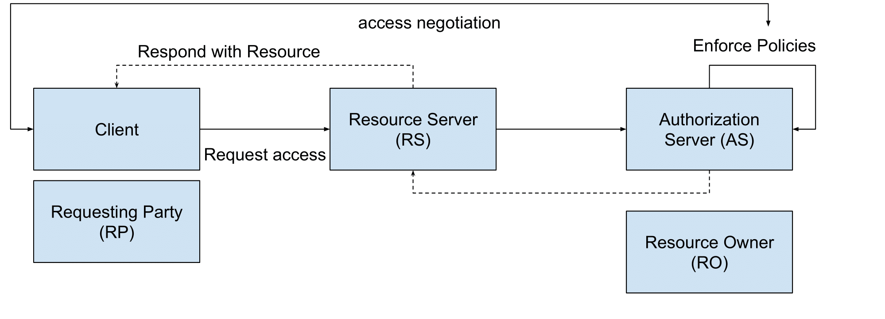
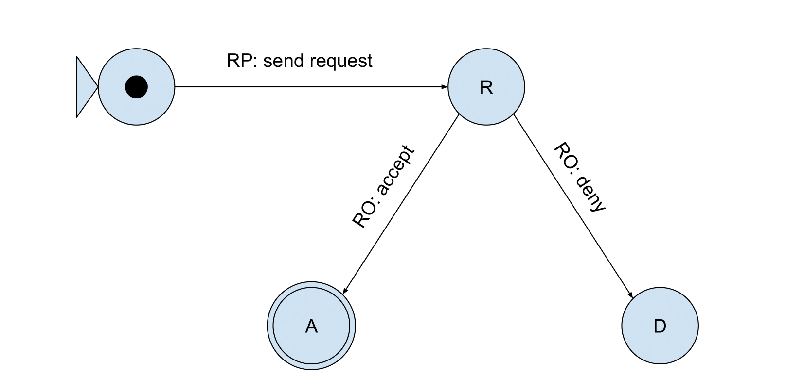

# Access Requests and Grants vs Data Space Negotiation Protocol (DSNP)

This document outlines the differences between simple access requests and grants and the data space negotiation protocol for allowing access to certain resources.
It starts by situating the use case and adding extra context, after which the message flow for each of the options is explained.

## Use Case

We'll be looking into the use case of accessing an online resource identified by an URI.
This resource is managed by a Resource Server (RS).
The Resource Owner (RO) can alter the policies on their resources via the Authorization Server (AS).
The AS enforces the policies set by the RO when the RP interacts with the RS (possibly through a Client).

This flow is visualized in the graph below:



In this specific use case, we will identify the following entities:

- Resource Owner: `https://pod.harrypodder.org/profile/card#me`
- Authorization Server: `http://localhost:4000`
- Resource Server: `http://localhost:3000/resources`
- Requesting Party: `https://example.pod.knows.idlab.ugent.be/profile/card#me`

The RP might interact with the RS and AS through a Client (e.g.: LOAMA).
The examples below will use either `text/turtle` or `application/ld+json` format.

## Access Requests and Grants flow

Of both options, this one is the simplest to implement.
Basicly, the RP will send a Request to the AS specifying the following:

- which resource they wish to access,
- what access rights they want (read, write, update...),
- who the requesting party is,
- the request status: always `requested`, and
- when the request was issued.

Once sent towards the AS by the RP, the request will be in `requested` state.
It will remain in this state until the RO decides to update it to `accepted` or `denied`.
Once it accepted, the request is `PATCH`ed to change the `requestStatus` to `accepted`.
This flow results in the FSM below:



### Endpoints Summary

- **POST** `/uma/requests`: create a new request.
- **GET** `/uma/requests`: fetch all requests linked to one of your resources.
- **GET** `/uma/requests/<encodedRequestIdentifier>`: fetch the representation of the request with id `RequestIdentifier`.
- **PATCH** `/uma/requests/<encodedRequestIdentifier>`: change the request status.

### Step 1: creating the Request

The RP creates the following `text/turtle` message:

```ttl
@prefix ex: <http://example.org/> .
@prefix req: <https://access.request.org/> .
@prefix odrl: <http://www.w3.org/ns/odrl/2/> .
@prefix xsd: <http://www.w3.org/2001/XMLSchema#> .

ex:request a req:Request ;
    req:issued "2025-08-21T11:24:34.999Z"^^xsd:datetime ;
    req:target <http://localhost:3000/resources/resource.txt> ;
    req:action odrl:read ;
    req:requester <https://example.pod.knows.idlab.ugent.be/profile/card#me> ;
    req:status req:requested .
```

In order to register the request with the AS, the Requester has to send a **POST** request to `/uma/requests`.
A simple curl request would look like this:

```shell-session
$ curl --location 'http://localhost:4000/uma/requests' \
--header 'Authorization: https://example.pod.knows.idlab.ugent.be/profile/card#me' \
--header 'Content-Type: text/turtle' \
--data-raw '
@prefix ex: <http://example.org/> .
@prefix req: <https://access.request.org/> .
@prefix odrl: <http://www.w3.org/ns/odrl/2/> .
@prefix xsd: <http://www.w3.org/2001/XMLSchema#> .

ex:request a req:Request ;
    req:issued "2025-08-21T11:24:34.999Z"^^xsd:datetime ;
    req:target <http://localhost:3000/resources/resource.txt> ;
    req:action odrl:read ;
    req:requester <https://example.pod.knows.idlab.ugent.be/profile/card#me> ;
    req:status req:requested .
'
```

The AS will see this request, and associate a unique `RequestIdentifier` to it.
This request will now be made available at the `/uma/requests/<encodedRequestIdentifier>` endpoint.

### Step 2: Accept (or deny) the request

The RO might want to check all requests for resources associated to them.
This should through a simple `GET` requests on `/uma/requests`, like the one below.
It is important to provide the correct authorization, as the AS should link this to all requests with targets linked to the RO's resources.

```shell-session
curl --header 'Authorization: https://pod.harrypodder.org/profil/card#me' 'http://localhost:4000/uma/requests'
```

When the RO wants to update the status of a request with id `RequestIdentifier`, they should provide a **PATCH** request to `/uma/request/<encodedRequestIdentifier>`.
This **PATCH** should include a body of format `application/sparql-update`, which uses a **DELETE/INSERT** statement to update the request's status to either `req:accepted` or `req:denied`.
In our use case, this message should look like this:

```shell-session
$ curl -X PATCH --location 'http://localhost:4000/uma/requests/<encodedRequestIdentifier>' \
--header 'Authorization: https://pod.harrypodder.org/profile/card#me' \
--header 'Content-type: application/sparql-update' \
--data-raw '
PREFIX req: <https://access.request.org/>

DELETE {
    ?request req:status req:requested
} INSERT {
    ?request req:status req:accepted
} WHERE {
    ?request req:target <http://localhost:3000/resources/resource.txt>
}
'
```

## Data Space Negotiation Protocol flow

## Implementation Details
