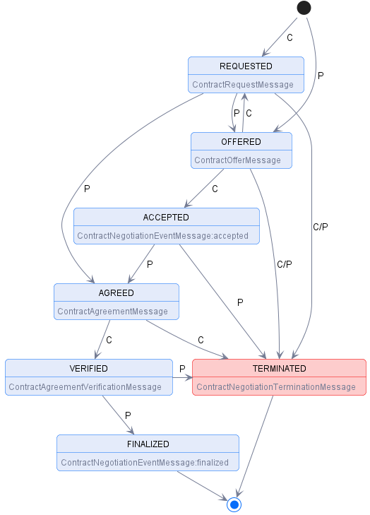

# Access Requests and Grants vs Data Space Contract Negotiation Protocol (DSNP)

This document outlines the differences between simple access requests and grants and the data space negotiation protocol for allowing access to certain resources.
It starts by situating the use case and adding extra context, after which the message flow for each of the options is explained.

## Use Case

We'll be looking into the use case of accessing an online resource identified by an URI.
This resource is managed by a Resource Server (RS).
The Resource Owner (RO) can alter the policies on their resources via the Authorization Server (AS).
The AS enforces the policies set by the RO when the RP interacts with the RS (possibly through a Client).

This flow is visualized in the graph below.
This document focuses on the message format and flow for the highlighted part of this graph.

<!-- TODO: this visualization is not completely correct and should be updated -->


In this specific use case, we will identify the following entities:

- **Resource Owner**: `https://pod.harrypodder.org/profile/card#me`
- **Authorization Server**: `http://localhost:4000`
- **Resource Server**: `http://localhost:3000/resources`
- **Requesting Party**: `https://example.pod.knows.idlab.ugent.be/profile/card#me`

The RP might interact with the RS and AS through a Client (e.g.: LOAMA).
The examples below will use either `text/turtle` or `application/ld+json` format.

## Access Requests and Grants flow

Of both options, this one is the simplest to implement.
Basicly, the RP will send a Request to the AS specifying the following:

- which **resource** they wish to access,
- what **access rights** they want (read, write, update...),
- who the **requesting party** is,
- the **request status**: always `requested`, and
- **when** the request was **issued**.

Once sent towards the AS by the RP, the request will be in `requested` state.
It will remain in this state until the RO decides to update it to `accepted` or `denied`.
Once it accepted, the request is `PATCH`ed to change the `requestStatus` to `accepted`.
This flow results in the FSM below:


### Endpoints Summary

- **POST** `/uma/requests`: create a new request.
- **GET** `/uma/requests`: fetch all requests linked to one of your resources.
- **GET** `/uma/requests/<encodedRequestIdentifier>`: fetch the representation of the request with id `RequestIdentifier`.
- **PATCH** `/uma/requests/<encodedRequestIdentifier>`: change the request status.

### Step 1: creating the Request

The RP creates the following `text/turtle` message:

```ttl
@prefix sotw: <https://w3id.org/force/sotw#> .
@prefix odrl: <http://www.w3.org/ns/odrl/2/> .
@prefix dcterms: <http://purl.org/dc/terms/> .
@prefix dct: <http://purl.org/dc/terms/> .
@prefix ex: <http://example.org/> .
@prefix xsd: <http://www.w3.org/2001/XMLSchema#> .

ex:request a sotw:EvaluationRequest ;
      dcterms:issued "2025-08-21T11:24:34.999Z"^^xsd:datetime ;
      sotw:requestedTarget <http://localhost:3000/resources/resource.txt> ;
      sotw:requestedAction odrl:read ;
      sotw:requestingParty <https://example.pod.knows.idlab.ugent.be/profile/card#me> ;
      ex:requestStatus ex:requested .
```

In order to register the request with the AS, the Requester has to send a **POST** request to `/uma/requests`.
A simple curl request would look like this:

```shell-session
curl --location 'http://localhost:4000/uma/requests' \
--header 'Authorization: https://example.pod.knows.idlab.ugent.be/profile/card#me' \
--header 'Content-Type: text/turtle' \
--data-raw '
@prefix sotw: <https://w3id.org/force/sotw#> .
@prefix odrl: <http://www.w3.org/ns/odrl/2/> .
@prefix dcterms: <http://purl.org/dc/terms/> .
@prefix dct: <http://purl.org/dc/terms/> .
@prefix ex: <http://example.org/> .
@prefix xsd: <http://www.w3.org/2001/XMLSchema#> .

ex:request a sotw:EvaluationRequest ;
      dcterms:issued "2025-08-21T11:24:34.999Z"^^xsd:datetime ;
      sotw:requestedTarget <http://localhost:3000/resources/resource.txt> ;
      sotw:requestedAction odrl:read ;
      sotw:requestingParty <https://example.pod.knows.idlab.ugent.be/profile/card#me> ;
      ex:requestStatus ex:requested .
'
```

The AS will see this request, and associate a unique `RequestIdentifier` to it.
This request will now be made available at the `/uma/requests/<encodedRequestIdentifier>` endpoint.

### Step 2: Accept (or deny) the request

The RO might want to check all requests for resources associated to them.
This should through a simple `GET` requests on `/uma/requests`, like the one below.
It is important to provide the correct authorization, as the AS should link this to all requests with targets linked to the RO's resources.

```shell-session
curl --header 'Authorization: https://pod.harrypodder.org/profil/card#me' 'http://localhost:4000/uma/requests'
```

When the RO wants to update the status of a request with id `RequestIdentifier`, they should provide a **PATCH** request to `/uma/request/<encodedRequestIdentifier>`.
This **PATCH** should include a body of format `application/sparql-update`, which uses a **DELETE/INSERT** statement to update the request's status to either `req:accepted` or `req:denied`.
In our use case, this message should look like this:

```shell-session
curl -X PATCH --location 'http://localhost:4000/uma/requests/<encodedRequestIdentifier>' \
--header 'Authorization: https://pod.harrypodder.org/profile/card#me' \
--header 'Content-type: application/sparql-update' \
--data-raw '
PREFIX req: <https://access.request.org/>

DELETE {
    ?request ex:requestStatus ex:requested
} INSERT {
    ?request ex:requestStatus ex:accepted # change to `ex:denied` in order to deny
} WHERE {
    ?request sotw:requestedTarget <http://localhost:3000/resources/resource.txt>
}
'
```

After this, the resource should be accessible for the RP.

## Data Space Contract Negotiation Protocol flow

This section explains the message flow for the second option: using the [Data Space Contract Negotiation Procotol](https://eclipse-dataspace-protocol-base.github.io/DataspaceProtocol/2025-1-RC4/#negotiation-protocol). Important to note is that this document is not an official W3C Membership consensus.
The examples below will make use of CURL to show the requests and headers, with the bodies specified in the `application/ld+json` format.

### Communicating Parties

The DSCNP discusses `Provider`s and `Consumer`s that communicate with eachother to access `Dataset`s that the `Provider` offers.
These `Dataset`s come with a `Policy`, however, that is beyond the scope of this example.
Instead, we focus on the `Contract Negotiation`s (CN).
Just like the `Request`s before, these CNs are identified through a unique IRI.
These CNs progress through a series of possible states, tracked by both `Provider` and `Consumer`.
Transitions are based on **ACK** `Message`s from the counter-party.

In our case, the `Provider` will be the Authorization Server, while the `Consumer` will be either the Requesting Party or its Client.
The `Consumer` *MUST* have an associated *callbackAddress` indicating where `Message`s should be sent:

- **Callback address**: `http://localhost:3000/callback`

### State diagram

The states are listed and explained in [section 7.1.1](https://eclipse-dataspace-protocol-base.github.io/DataspaceProtocol/2025-1-RC4/#contract-negotiation-states).
The state diagram below is copied from [section 7.1.2](https://eclipse-dataspace-protocol-base.github.io/DataspaceProtocol/2025-1-RC4/#state-machine):



### Step 1: **REQUESTED**

This document only considers the case in which the RP initiates the protocol by sending a [`ContractRequestMessage`](https://eclipse-dataspace-protocol-base.github.io/DataspaceProtocol/2025-1-RC4/#contract-request-message) to the AS.
The other case is analogous, except for the initial message (which should be swapped for an initiating [`ContractOfferMessage`](https://eclipse-dataspace-protocol-base.github.io/DataspaceProtocol/2025-1-RC4/#contract-offer-message)).

The most important features in our `ContractRequestMessage` are the following:

- an `offer`, which *MUST* have an `@id` property and specifies the terms (permissions) at which the RP will accept an [`Offer`](https://eclipse-dataspace-protocol-base.github.io/DataspaceProtocol/2025-1-RC4/#dfn-offer).
- the callback address for asynchronous communication.

The example request would be formatted like this:

```json
{
    "@context": [
        "https://w3id.org/dspace/2025/1/context.jsonld"
    ],
    "@type": "ContractRequestMessage",
    "consumerPid": "urn:uuid:<RequestingPartyUUID>",
    "offer": {
        "@type": "Offer",
        "@id": "urn:uuid:<OfferUUID>",
        "target": "urn:uuid:<ResourceUUID>",
        "permission": [
            {
                "action": "read"
            }
        ]
    },
    "callbackAddress": "https://localhost:3000/callback"
}
```

The AS *MUST* provide the following endpoint:

- **POST** `/negotiations/request`: [Contract Request Endpoint (init)](https://eclipse-dataspace-protocol-base.github.io/DataspaceProtocol/2025-1-RC4/#negotiations-request-post)

A valid message would thus be:

```shell-session
curl --location 'http://localhost:4000/uma/negotiations/request' \
--header 'Authorization: https://example.pod.knows.idlab.ugent.be/profile/card#me' \
--header 'Content-Type: application/ld+json' \
--data-raw ' {
    "@context": [
        "https://w3id.org/dspace/2025/1/context.jsonld"
    ],
    "@type": "ContractRequestMessage",
    "consumerPid": "urn:uuid:<RequestingPartyUUID>",
    "offer": {
        "@type": "Offer",
        "@id": "urn:uuid:<OfferUUID>",
        "target": "urn:uuid:<ResourceUUID>",
        "permission": [
            {
                "action": "read"
            }
        ]
    },
    "callbackAddress": "https://localhost:3000/callback"
}'
```

However, the DSCNP protocol does require one more action in order to transfer both `Consumer` and `Provider` towards the **REQUESTED** state: the AS *MUST* respond with an **ACK** formatted like below.
The standard, however, doesn't provide any guidelines on where this message should be sent, other than that it should be sent towards the callback address.

```json
{
    "@context": [
        "https://w3id.org/dspace/2025/1/context.jsonld"
    ],
    "@type": "ContractNegotiation",
    "consumerPid": "urn:uuid:<RequestingPartyUUID>",
    "providerPid": "urn:uuid:<AuthorizationServerUUID>",
    "state": "REQUESTED"
}
```

### Step 2: **AGREED**

Our example will assume the best case: the AS agrees with the terms of the RP, and will accept this offer.
The AS will now send a `ContractAgreementMessage` towards the callback address of the consumer:

```json
{
    "@context": [
        "https://w3id.org/dspace/2025/1/context.jsonld"
    ],
    "@type": "ContractAgreementMessage",
    "consumerPid": "urn:uuid:<RequestingPartyUUID>",
    "providerPid": "urn:uuid:<AuthorizationServerUUID>",
    "agreement": {
        "@id": "urn:uuid:<AgreementUUID>",
        "@type": "Agreement",
        "target": "urn:uuid:<ResourceUUID>",
        "timestamp": "2025-08-21T14:09:57.056Z",
        "assigner": "http://pod.harrypodder.org/profile/card#me",
        "assignee": "https://example.pod.knows.idlab.ugent.be/profile/card#me",
        "permission": [
            "action": "read"
        ]
    }
}
```

The AS should send this message to the following endpoint under the callback address:

- **POST** `/negotiations/:consumerPid/agreement`: [Contract Agreement Endpoint](https://eclipse-dataspace-protocol-base.github.io/DataspaceProtocol/2025-1-RC4/#negotiations-consumerpid-agreement-post).

A valid message looks like this:

```shell-session
curl --location 'http://localhost:3000/callback/negotiations/<encodedRequestingPartyUUID>/agreement' \
--header 'Authorization: https://pod.harrypodder.org/profile/card#me' \
--header 'Content-Type: application/ld+json' \
--data-raw '{
    "@context": [
        "https://w3id.org/dspace/2025/1/context.jsonld"
    ],
    "@type": "ContractAgreementMessage",
    "consumerPid": "urn:uuid:<RequestingPartyUUID>",
    "providerPid": "urn:uuid:<AuthorizationServerUUID>",
    "agreement": {
        "@id": "urn:uuid:<AgreementUUID>",
        "@type": "Agreement",
        "target": "urn:uuid:<ResourceUUID>",
        "timestamp": "2025-08-21T14:09:57.056Z",
        "assigner": "http://pod.harrypodder.org/profile/card#me",
        "assignee": "https://example.pod.knows.idlab.ugent.be/profile/card#me",
        "permission": [
            "action": "read"
        ]
    }
}'
```

The RP will respond with a valid **ACK** message in order to move on to the next step:

```json
{
    "@context": [
        "https://w3id.org/dspace/2025/1/context.jsonld"
    ],
    "@type": "ContractNegotiation",
    "consumerPid": "urn:uuid:<RequestingPartyUUID>",
    "providerPid": "urn:uuid:<AuthorizationServerUUID>",
    "state": "AGREED"
}
```

### Step 3: **VERIFICATION**

The RP **MUST** send a `ContractAgreementVerificationMessage` in order to be able to transition to the **VERIFICATION** state.
This message simply looks like this:

```json
{
    "@context": [
        "https://w3id.org/dspace/2025/1/context.jsonld"
    ],
    "@type": "ContractAgreementVerificationMessage",
    "consumerPid": "urn:uuid:<RequestingPartyUUID>",
    "providerPid": "urn:uuid:<AuthorizationServerUUID>"
}
```

It should be sent to the following endpoint on the AS:

- **POST** `/negotiations/:providerPid/agreement/verification`: [Contract Agreement Verification Endpoint](https://eclipse-dataspace-protocol-base.github.io/DataspaceProtocol/2025-1-RC4/#negotiations-providerpid-agreement-verification-post).

```shell-session
curl --location 'http://localhost:4000/uma/negotiations/<encodedAuthorizationServerUUID>/agreement/verification' \
--header 'Authorization: https://example.pod.knows.idlab.ugent.be/profile/card#me' \
--header 'Content-Type: application/ld+json' \
--data-raw ' {
    "@context": [
        "https://w3id.org/dspace/2025/1/context.jsonld"
    ],
    "@type": "ContractAgreementVerificationMessage",
    "consumerPid": "urn:uuid:<RequestingPartyUUID>",
    "providerPid": "urn:uuid:<AuthorizationServerUUID>"
}'
```

To which the AS will respond with the following **ACK** message:

```json
{
    "@context": [
        "https://w3id.org/dspace/2025/1/context.jsonld"
    ],
    "@type": "ContractNegotiation",
    "consumerPid": "urn:uuid:<RequestingPartyUUID>",
    "providerPid": "urn:uuid:<AuthorizationServerUUID>",
    "state": "VERIFIED"
}
```

### Step 4: **FINALIZED**

The AS *MUST* now sent one final `ContractNegotiationEventMessage` towards the RP:

```json
{
    "@context": [
        "https://w3id.org/dspace/2025/1/context.jsonld"
    ],
    "@type": "ContractNegotiationEventMessage",
    "consumerPid": "urn:uuid:<RequestingPartyUUID>",
    "providerPid": "urn:uuid:<AuthorizationServerUUID>",
    "eventType": "FINALIZED"
}
```

This must once again be sent to a different endpoint on the callback address:

- **POST** `/negotiations/:consumerPid/events`: [Contract Negotiation Event Endpoint](https://eclipse-dataspace-protocol-base.github.io/DataspaceProtocol/2025-1-RC4/#negotiations-consumerpid-events-post).

```shell-session
curl --location 'http://localhost:3000/callback/negotiations/<encodedRequestingPartyUUID>/events' \
--header 'Authorization: https://pod.harrypodder.org/profile/card#me' \
--header 'Content-Type: application/ld+json' \
--data-raw '{
    "@context": [
        "https://w3id.org/dspace/2025/1/context.jsonld"
    ],
    "@type": "ContractNegotiationEventMessage",
    "consumerPid": "urn:uuid:<RequestingPartyUUID>",
    "providerPid": "urn:uuid:<AuthorizationServerUUID>",
    "eventType": "FINALIZED"
}'
```

After which the RP must send one more **ACK** message for the data to become available:

```json
{
    "@context": [
        "https://w3id.org/dspace/2025/1/context.jsonld"
    ],
    "@type": "ContractNegotiation",
    "consumerPid": "urn:uuid:<RequestingPartyUUID>",
    "providerPid": "urn:uuid:<AuthorizationServerUUID>",
    "state": "FINALIZED"
}
```

### Important notes

The scenario sketched above follows the *happy path* where all parties agree and all messages are received correctly.
In case there are any errors or disagreements amongst the communicating parties, the content negotiation protocol allows for verbose re-negotiation as well as termination of the agreement.
When implementing this option, all these scenarios should be included and accounted for.

## Implementation Details

These notes were discussed in private, but provide valuable information during implementation of either option.

- **resource coupling to RO**: neither of the request message flows holds any reference to the resource owner.
    The UMA AS implementation should provide this coupling internally in order to provide ROs with requests concering their resources.

- **absence of policies for resources**: the current UMA AS implementation holds a record of policies for resources.
    When the AS receives a request for access to an unknown resource, it should possibly not return a 404 status code, as to not leak the information about the non-existence of a certain resource.
    Discoverable policies thus provide a finite set of resources the AS manages and accepts requests for.

## Future work

- **map current solution to data spaces solution**: the current choice to solve the problem is by using the request-grant model described in [the first part](#access-requests-and-grants-flow).
However, it is important to keep the data spaces model in mind to offer compatibility in the future.
