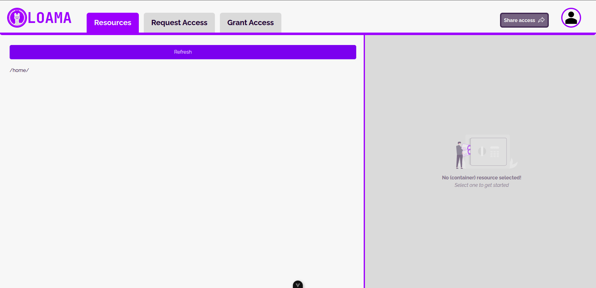
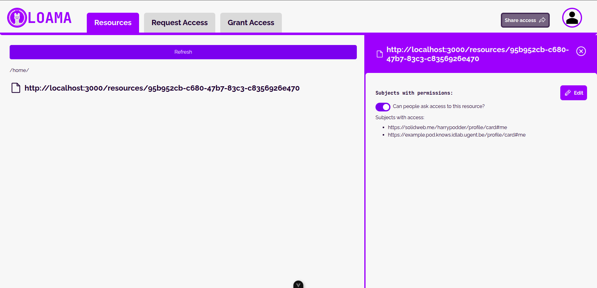

# The Cold Start Problem

LOAMA allows users to manage their own user-managed policies for content access.
It does this by communicating with the backend Authorization Server (AS) and adding/removing rules to policies.

This approach introduces one problem: LOAMA cannot create new policies on resources from its user interface.
We introduced a (temporary) script to help quickly set up policies on new resources.
This way, you don't have to manually use curl commands to set up your initial policies.

The image below shows LOAMA's empty homepage.
There is no option to create a new policy for a resource, as such we need this script to populate the AS for new users.



The script is straightforward in use, but allows for some customization.
The example below illustrates its use:

```shell-session
# start the script using "yarn cold"
> yarn cold
yarn run v1.22.22
$ tsx --env-file=.env scripts/cold-start
To use default ENV vars, leave empty.
Please provide your own WebID for authorization: 
What do you want to name your policy? 
Please enter the URL to the resource: 
Please provide the WebID for the assignee: 
Enter actions to associate (comma separated). Options: read, write, append, create, control: read

POST request with body

        @prefix ex: <http://example.org/>.
        @prefix odrl: <http://www.w3.org/ns/odrl/2/> .
        @prefix dct: <http://purl.org/dc/terms/>.

        ex:07e08a26-9655-4b63-aa6b-5ac2ec0ddaa5 a odrl:Agreement ;
                     odrl:permission ex:adecea94-275d-4e48-8f8d-2a735903502f ;
                     odrl:uid ex:07e08a26-9655-4b63-aa6b-5ac2ec0ddaa5 .
        
        ex:adecea94-275d-4e48-8f8d-2a735903502f a odrl:Permission ;
                   odrl:action odrl:read ;
                   odrl:target <http://localhost:3000/resources/95b952cb-c680-47b7-83c3-c8356926e470> ;
                   odrl:assignee <https://example.pod.knows.idlab.ugent.be/profile/card#me> ;
                   odrl:assigner <https://solidweb.me/harrypodder/profile/card#me> .
    
Policy added successfully
Done in 7.51s.
```

LOAMA's frontend will now show the policy for the resource:



## Default variables in .env files

It is possible to define some default variables.
The script will read these from the .env file and use these values if the answers are left empty.
If no .env file is provided, the script will use fallback default values.

These default values can be summarized in this example .env file:

```env
ASSIGNEE_IRI="https://example.pod.knows.idlab.ugent.be/profile/card#me"
ASSIGNER_IRI="https://example.pod.knows.idlab.ugent.be/profile/card#me"
RESOURCE_SERVER="http://localhost:3000/"
AUTHORIZATION_SERVER="http://localhost:4000/"
```

Notice the trailing slashes for the resource and authorization servers.
The script assumes that the policy endpoint is running under `/uma/policies`.
Resources are always created under the `/resources` path.
