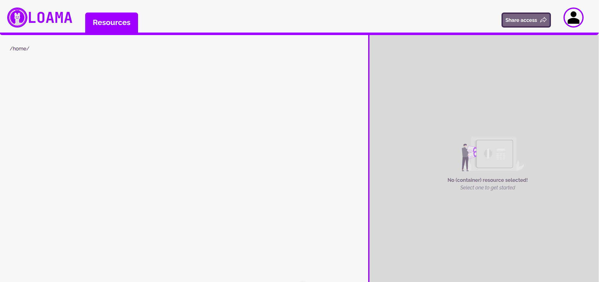
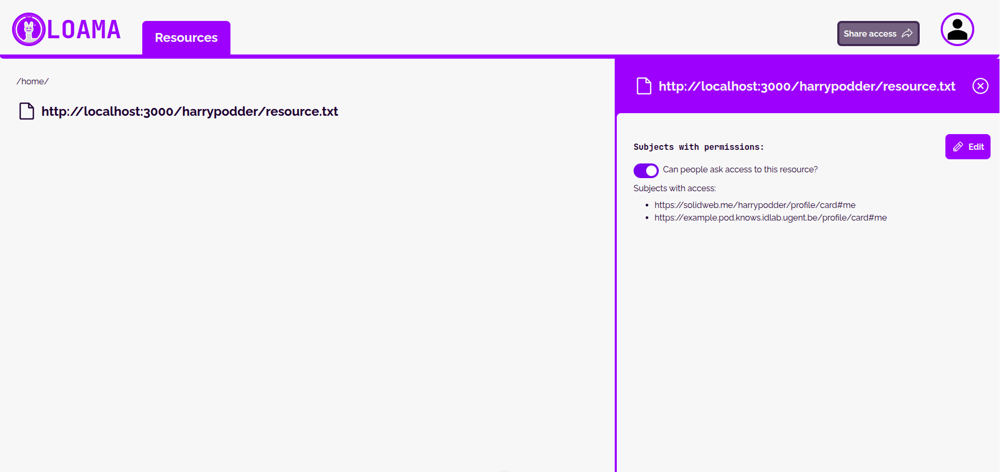

# The Cold Start Problem

LOAMA allows users to manage their own user-managed policies for content access.
It does this by communicating with the backend AS and adding rules or stripping them away from existing policies.
This approach introduces one problem: LOAMA cannot create new policies on new resources from its user interface.
We introduced a (temporary) script to help users quickly setup policies on new resources. This way, you don't have to manually use curl commands to setup your initial policies.

The image below shows LOAMA's empty homepage. There is no option to create a new policy for a resource, as such we need [this script](../scripts/cold-start.ts) to populate the AS for new users.



The script is pretty straight forward in use.
See the example below:

```shell-session
$ npm run cold

> cold
> ts-node scripts/cold-start

Please provide your own WebID for authorization: https://solidweb.me/harrypodder/profile/card#me
What do you want to name your policy? policy
What do you want your rule to be named? permission
What action do you want to associate? Choose one below: 
	- read    [1]
	- write   [2]
	- append  [3]
	- create  [4]
	- control [5]
1
Please enter the URL to the resource: http://localhost:3000/harrypodder/resource.txt
Please provide the WebID for the assignee: https://example.pod.knows.idlab.ugent.be/profile/card#me

POST request with body

        @prefix ex: <http://example.org/>.
        @prefix odrl: <http://www.w3.org/ns/odrl/2/> .
        @prefix dct: <http://purl.org/dc/terms/>.

        ex:policy a odrl:Agreement .
        ex:policy odrl:permission ex:permission .
        ex:permission a odrl:Permission .
        ex:permission odrl:action odrl:read .
        ex:permission odrl:target <http://localhost:3000/harrypodder/resource.txt> .
        ex:permission odrl:assignee <https://example.pod.knows.idlab.ugent.be/profile/card#me> .
        ex:permission odrl:assigner <https://solidweb.me/harrypodder/profile/card#me> .
    
Policy added succesfully
```

This will create the following result in LOAMA:


