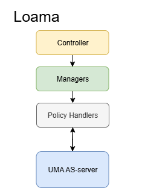
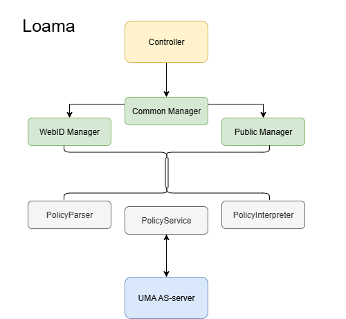

# Linked Open Access Management Application with UMA

This documentation describes the important changes made to transform Loama into an ODRL-policy based access management application. 

## App Structure

The app follows a three-layered structure: The **controller**, the **managers** and the **policy handlers**.

The **controller** contains the high level operations that Loama provides. These operations include editing (adding/removing) permissions, retrieving permission information for each target, and managing subjects. Other functionalities, such as access requests, are outside the scope of these changes. 

To support different subjects (public and webID), the controller uses the same preconfigured managers and resolvers. Each manager and resolver handles tasks specific to one subject type. Common functionality shared between managers is grouped in a base class called `InruptPermissionManager.ts`. 

To keep the manager codebase concise, they delegate policy-related tasks to helper classes: `PolicyParser`, `PolicyInterpreter` and `PolicyService`. These provide the foundational logic needed by the managers. The only class that interacts with the UMA Authorization Server (AS) is the `PolicyService`

### Policy Helper Classes

This section describes the implementation of the `PolicyParser`, `PolicyInterpreter` and `PolicyService`. These classes do not follow the generic type system as used in the rest of the controller-structure.

#### PolicyParser

The `PolicyParser` is used to convert text into an `N3.store`. It assumes the text is in Turtle format, as that is the format returned by the UMA server. The class exposes one parsing method.

#### PoliyInterpreter

The `PolicyInterpreter` is the class that extracts the necessary information out of a given `N3.Store`. It contains one helper function, and two main functions:
- `ownedPoliciesToObject`: Get every policy for the logged on client, and group them by target. Return an information object for each target to indicate who has what permission, as documented in the code.
- `permissionsForOneResource`: Use the `ownedPoliciesToObject` with a specified target. This retrieves permission information for one single target.
- `extractQuadsRecursive`: Helper function to get all information about a subject with recursive depth, used in `ownedPoliciesToObject`.

#### PolicyService

The `PolicyService` is used to make the required UMA server calls. Its main responsibilities are retrieving policies, inserting atomic permission rules and deleting them. The URL to the UMA AS-server is hard-coded, but will be replaced once a better solution is found.

- `fetchPolicies`: Retrieve every policy that you own, and turn it into an N3 store.
- `fetchOnePolicy`: Retrieve one specific policy as an N3 store.

- `insertActionRule`: Given the target ID, the permissions to add and the specified subject, create a new rule for every action to be inserted. The new rules contain the logged on client as the assigner, the new subject as assignee (or none if no subject was specified, this means the subject is public), the target ID as odrl:target and the action to be inserted as odrl:action. The rule is inserted in an existing policy, or a new policy is created when this target did not have a policy before.

    There are some things to be considered about this function.
    1. It currently generates a random policy (if needed) and rule ID, but does not check if it already exists. The chances are slim that this happens, but not zero.
    2. The current version will always PATCH, since there will always be a policy for the target (otherwise it would not be displayed in the first place). The POST exists in case something went wrong.

- `deleteActionRule`: Given the target ID, the permissions to be deleted and the specified subject, remove the atomic rules where the subject has these permissions for this target. 

    This function also has many things to consider.
    1. It first fetches and parses every policy of the logged on client. It then finds every policy where the subject has one of the permissions to delete. After this, it performs a query that tracks the rules to delete from every policy.
    This is a lot of work, because the UMA server is very policy-oriented. We first need to extract the policies, to send the PATCH to `/policies/<encodedPolicyId>`. An idea could be to add target-oriented/rule-oriented features to the server. 

    2. When every rule is deleted from a policy, the current implementation can still contain some 'dangling triples'. These are triples that contain information about a policy that does not have any rules anymore. This can be fixed by an extra step. After the deletion of every permission rule, we could GET every policy again, and look if there are any rules left in there. If not, we could DELETE the policy. This is also some work, so we are currently looking for better solutions.

    3. Although it seems quite impossible, things like sparql-injection might need more attention

##### Using PATCH to our advantage
LOAMA previously required explicit **refresh** calls to stay in sync after edits. With our UMA AS-server, this is no longer needed: the PATCH response returns the updated state, which can be passed through directly instead of triggering redundant GET calls.

### Managers

The main managers are the `InruptPermissionManager`, the `WebIdManager` and the `PublicManager`. They contain the logic to perform the client-side operations on the policies.

#### InruptPermissionManager
This manager handles functionality shared across all subject types. The methods in this manager are the following:
- `getContainerPermissionList`: Get every target where you are the assigner of its policy. Since we need every target, independent of the subject, it could be placed here.
It is to be said that the meaning of this function changed. The old implementation fetched the permissions for one specific container, we fetch it from the logged on user. This makes the argument `containerUrl: string` redundant. The argument `resourceToSkip: string[] = []` has been ignored, since no useful purpose of this was found.

There are also functions here where it would make more sense to move them to their specific subject manager.
- `getRemotePermissions`: Get the permissions for one single target. We do retrieve the information in a way that we get every subject, but we need to handle those subjects in the common managers. This means adding a new subject would require changes in the common manager, which would be cleaner if moved to the separate managers.
- `getTargetPermissionsForUser`: A specific version of getRemotePermissions, where we are only interested in the permissions for one user on one target. This must be moved to the underlying managers. This function will probably be removed in the future. 

#### Subejct-Specific Managers
Because most of the work is done in the `PolicyService` and `PolicyInterpreter`, there is no big implementation in the WebID and Public Manager. Their `createPermissions` and `deletePermissions` functions are one-liners, and the `editPermissions` is not actually needed in this implementation. 

### Controller
High level logic is implemented in the controller. It uses the managers to delegate the main functionality of the application. The functions that remained unchanged are:
- `getSubjectConfig`: Given a subject, return is its configuration (manager, resolver).
- `getExistingRemotePermissions`: Given a resource and a subject, get the list of permissions of that subject for the resource.
- `AccessRequest`: Returns the IAccessRequest
- `getLabelForSubject`: Uses the resolver of the subject to return its label.
- `isSubjectSupported`: Check if there is a configuration that supports the subject type.

The functions that have a new implementations are the following:
- `addPermission`: The new implementation became very short:
    1. Let the specific manager create the permission for the subject.
    2. Even though the server already returns an updated version, we cannot return this in the current interface. We just fetch the new permissions using  `getTargetPermissionsForUser` from the manager, which we might change to the `getExistingRemotePermissions` from the controller.
- `removePermission`: Works exactly the same as `addPermission`, uses the deletePermissions function from the manager.
- `getContainerPermissionList`: This is nothing but a call to the manager's `getContainerPermissionList` function. Its implementation has been reduced a lot, but the current way is not clean. Because we know that we only need one manager to get every target and their permission info, we need to force our way to get only one. We do this by getting the public configuration, even though the controller is not exactly sure that this one exists. This works, because we know it exists. It's not a good solution and should be replaced, even though it works fine.
- `getResourcePermissionList`: Works exactly the same as `getContainerPermissionList`, it just calls the `getRemotePermissions`.
- `getItem`: Get the permission information for a subject on a resource. It works fine, but the ID and request ID are not present (since we have not implemented them).
- `removeSubject`: Remove all permissions for a subject. We first collect the permissions for one user, and then we go on and delete them.

The functions that we do not need in the new implementation are:
- `getExistingPermissions`: Our implementation always gets the data straight from the server. This function was used in the index-context, which has been replaced by the UMA AS-server.
- `updateItem`: This function was used to set certain permissions for a target. Because our functionality only uses `addPermission` and `removePermission`, no `updateItem` is necessary. 
- `enablePermissions`/`disablePermissions`: We have removed the old implementation, and have no interest to find a way to implement this the odrl way.
- Index related functions that we no longer need:
    - `setPodUrl`
    - `unsetPodUrl`
    - `getOrCreateIndex`

    The downside of these functions is the fact that the front end still uses some, but they don't need to anymore. This causes some side effects that need to be looked at in more detail.

## Impact of UMA
The introduction of the UMA server to this project reduced the controller and manager side significantly. It introduced independent classes to handle the server calls (PolicyService) and to turn policies into the format required by the frontend (PolicyInterpreter). 

Because the most important part of the logic is implemented in those independent classes, the managers and controllers take on a delegating role. The reason why it's still important to have them, is to separate concerns:
- The controller contains top level, generic functionality. They just need to call the right managers based on the relevant subjects. The controller does not have any direct contact to the independent Policy helper classes.
- Managers contain specific functionality. They are in direct contact with the Policy Helper classes.